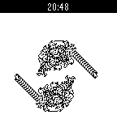

pebble-langtons-anthill
=======================

[Langton's Ant](http://en.wikipedia.org/wiki/Langton%27s_ant) is a
two-dimensional Turing machine with a very simple set of rules but complicated
emergent behaviour. Langton's Anthill simulates one or more ants on a toroidal
Pebble-sized field.

Build status: 

Link to latest successfully built app bundle as soon as the spectacularly
awesome [CloudPebble](http://cloudpebble.net) supports it.

Appstore: 

License
-------

The code uses the MIT license. See the LICENSE file for details.

One of the images used in the appstore makes use of the
[Pebble UI Template](https://github.com/mcongrove/PebbleUI) project, which is
available under a
[Creative Commons](http://creativecommons.org/licenses/by-sa/4.0/deed.en_US)
license.

Making it work
--------------

You'll need to set up a dev environment as described in the
[Pebble SDK 2.0 docs](http://developer.getpebble.com/2/). Use the
[pebble tool](https://developer.getpebble.com/2/getting-started/pebble-tool/)
to build and install.

Bugs and issues
---------------

There are no known bugs, because I haven't figured out how to write unit tests
for Pebble projects.
